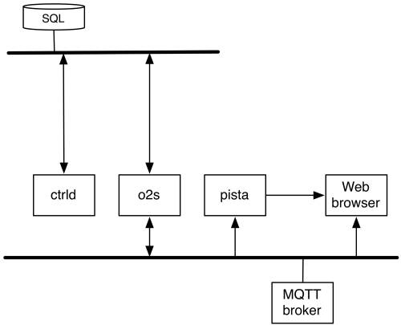
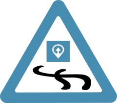

## Pista

The OwnTracks back-end is a set of components intended to work with the [owntracks.org](http://owntracks.org) apps for Android and iOS as well as the Greenwich, OwnTracks edition.

This back-end superceeds what has so-far been known as `m2s`, but has, in all honesty, a focus on the OwnTracks Greenwich devices, so there are features here which will not be useful for app users. If you are an app user and wish to experiment with the OwnTracks back-end, read [Migration](#migration) before continuing.

The backend consists of a number of utilities:

* [o2s](#o2s)
* [pista](#pista)
* [ctrld](#ctrld)




These components work hand-in-hand and consist of a number of _features_ which can be
enabled/disabled through a configuration file. Although we have attempted to test different
combinations of features, be warned that not all combinations are extensively tested. Our
environment uses all features, and this documentation discusses these.

Keep a copy of the extensively documented configuration file `o2s.conf.sample` handy for reference.

### `o2s`

_o2s_ (OwnTracks to Storage) is responsible for subscribing to MQTT for the OwnTracks topics and comitting these to storage (i.e. to a database). In particular, _o2s_ also provides support for

* Republishing formatted debugging strings to the `_look` topic
* Republishing whole "objects" to the `_map/` topic
* Recording statistics in Redis
* Handling geo-fences from waypoints (enter/leave)

Upon startup, _o2s_ subscribes to the configured MQTT broker awaiting publishes
from OwnTracks devices. Location publishes are comitted to storage as are Waypoint
publishes.

#### Reverse-Geo lookups

Every time we receive a location update, we check whether this update is within
reasonable distance from one we already know of, and if so, we use a previously
cached reverse-geo information so as to not impose on online services. This caching
is performed by storing the [geohash](http://en.wikipedia.org/wiki/Geohash) of
the lat,lon pair using
[python-geohash](https://code.google.com/p/python-geohash/), and truncating the
result to six characters.

Consider the following example which illustrates how a six character hash is
equivalent to reducing precision on lat, lon:

```python
import geohash
import sys

lat = 47.488613
lon = 13.187296

print "Original lat,lon: ", lat, lon
full = geohash.encode(float(lat), float(lon))
print "Full geohash: ", full

hashlen = 6

print geohash.encode(47.488613,  13.187296)[:hashlen]
print geohash.encode(47.48861,  13.18729)[:hashlen]
print geohash.encode(47.4886,  13.1872)[:hashlen]
print geohash.encode(47.488,  13.187)[:hashlen]
```

The program outputs:

```
Original lat,lon:  47.488613 13.187296
Full geohash:  u23qhj49nr0d
u23qhj
u23qhj
u23qhj
u23qhh
```

See [geohash.org](http://geohash.org).


#### Redis

```
redis 127.0.0.1:6379> keys *X1*
1) "driving:X1"
2) "lastloc:X1"
3) "t:owntracks/gw/X1"
4) "vbatt:owntracks/gw/X1"
5) "vext:owntracks/gw/X1"
redis 127.0.0.1:6379> hgetall driving:X1
1) "tid"
2) "X1"
3) "tst"
4) "1414238743"
5) "vel"
6) "91"
7) "trip"
8) "306878"
redis 127.0.0.1:6379> hgetall lastloc:X1
1) "lat"
2) "46.70984"
3) "tst"
4) "1414238743"
5) "lon"
6) "8.607769"
```

#### `_map/`

Other publishes from devices (e.g. `startup/`, `gpio/`, `voltage/` are gathered
together to form an "object" which is published to `_map/` when it changes. This object
is used by _pista_ to display information in its individual pages. An object published
thusly might look like this:

```json
{
  "vel": 0,
  "tstamp": "2014-11-01T09:48:53Z",
  "tst": 1414835333,
  "topic": "owntracks/gw/BB",
  "tid": "BB",
  "status": -1,
  "lon": -5.184415,
  "_type": "location",
  "addr": "A-397, 29400 Ronda, Málaga, Spain",
  "alt": 569,
  "cc": "ES",
  "cog": 0,
  "compass": "N",
  "dstamp": "01/10:48:53",
  "lat": 36.766928
}
```

Note for example the `tstamp`, `status`, `addr`, and `compass` elements which are not part
of the [OwnTracks JSON](https://github.com/owntracks/owntracks/wiki/JSON) format for Location
publishes. These elements are assembled by _o2s_ into this object.

#### Waypoints

_map/9e33dafec92ce71a34f3cf10b8d747b7834bda7e {"lat": 51.1694, "radius": 300, "_type": "fence", "lon": 4.38942, "waypoint": "LOADays"}

#### `_alerts/`

```json
{
  "wptopic": "owntracks/gw/BB",
  "wpname": "our favorite restaurant",
  "wplon": xxx.xxx,
  "wplat": yyy.yyy,
  "vel": 0,
  "tstamp": "2014-10-30T18:06:49Z",
  "event": "leaves",
  "dstamp": "30/19:06:49",
  "compass": "N",
  "cog": 0,
  "cc": "DE",
  "alt": 186,
  "addr": "Demo Way 27",
  "_type": "alert",
  "km": "56.08",
  "lat": xxx.xxx,
  "lon": yyy.yyy,
  "meters": 128,
  "status": 1,
  "tid": "BB",
  "trigger": 0,
  "tst": 1414692409
}
```


### `pista`



_pista_ (the Spanish word for _track_) is a Python Bottle app which works hand-in-hand with _o2s_ for displaying data, maps, tracks and information from that database.


Ensure you've configured `o2s.conf` and that the environment variable
`O2SCONFIG` points to that file so that _pista_ will be able to access _o2s_' database.

Copy `pista.conf.sample` to `pista.conf`, adjust the settings therein as described in the comments, and configure the environment variable `PISTACONFIG` to point to that file.

Run `./pista.py` and connect to it with a supported Web browser. By default, the address is `http://127.0.0.1:8080`.


### Credits

* Brand image from [openclipart](https://openclipart.org/detail/28088/Roadsign_slippery-by-Simarilius)

### `ctrld`

_ctrld_ (CTRL Daemon) is a RESTful API for
[CTRL](https://github.com/owntracks/OwnTracksCTRL), a specialized utility which
is probably not something you readily require, but it is, nevertheless, part of
the back-end.

It basically provides authentication services and track dumps for this app, and is able to
supply an X.509 CA certificate for MQTT connections.

### Prerequisites

In order to run the OwnTracks back-end you will need:

* An MQTT broker with Websockets capabilities. This could be, say, Mosquitto (version 1.4 or higher) or HiveMQ.
* A database supported by `o2s`; this is currently one of SQLite, PostgreSQL or MySQL, whereby we test only with the latter.
* Optionally (and highly recommended), access to a Redis key/value store.
* A Linux host
* Python 2.7.x
* An optional HTTP server (Apache or nginx)
* Quite a bit of patience


### Installation


#### uWSGI

### Testing

### Migration from `m2s`
